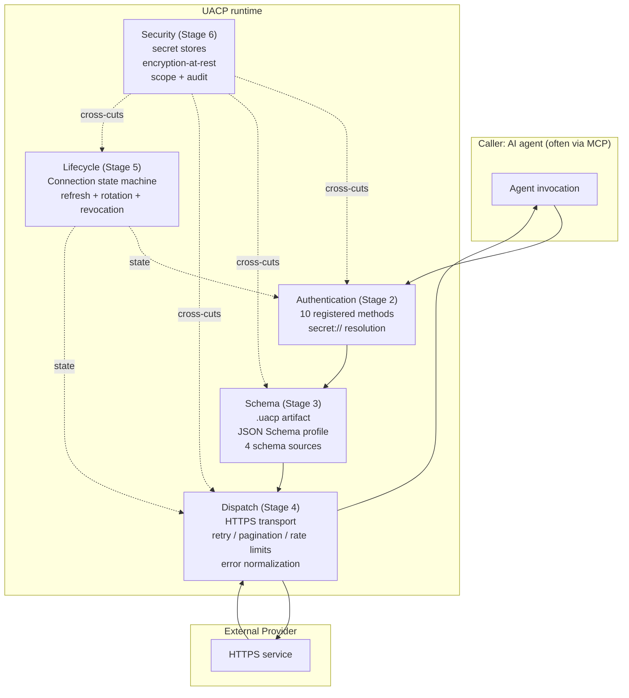

# UACP — Layered architecture

UACP organizes its specification into five subsystems that compose top-down at every dispatch. The Authentication layer (Stage 2) resolves credentials through `secret://` references. The Schema layer (Stage 3) describes operations and validates them against the JSON Schema profile. The Dispatch layer (Stage 4) carries the validated request over HTTPS, applies retry / pagination / rate-limit handling, and normalizes errors. The Lifecycle layer (Stage 5) sits alongside, owning Connection state and refresh-token rotation. The Security layer (Stage 6) cross-cuts every other layer with the secret-store registry, encryption-at-rest, scope enforcement, and audit logging.

Versioning (Stage 7) governs how the four other subsystems evolve over time without breaking conformance: every `v1.x` release is non-breaking per §7.2, and `v2` follows the public RFC process per §7.6.
