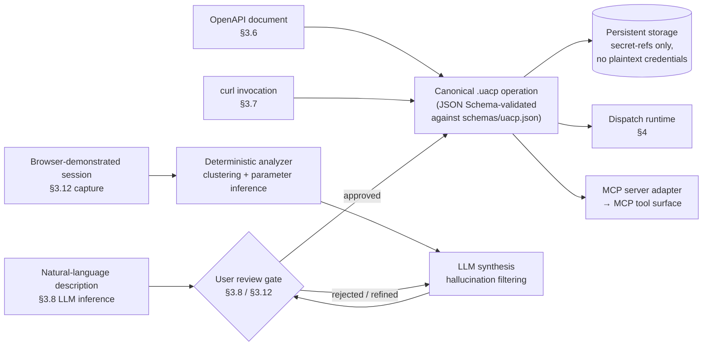

# UACP — Schema source convergence

UACP accepts four schema sources, all of which converge on the same canonical `.uacp` operation form before persistence. OpenAPI ingestion (§3.6) lifts operations from a published spec; curl-paste (§3.7) captures a single request from a `curl` invocation and infers the operation around it; LLM inference (§3.8) produces a draft from a natural-language description and gates it on explicit user review; session capture (§3.12, added in v1.1) records a browser-demonstrated session, clusters the captured requests deterministically, and uses an LLM to draft operations under the same mandatory user-review gate.

This is the visual for "universal-by-design": the spec doesn't care which source produced the artifact, only that the canonical form validates.

Source provenance (§3.5) is preserved on every operation: `source.type` records which path produced it, and the `inferred` and `capture` paths additionally carry `model`, `description` / `user_intent`, and `reviewed_at` fields enforced at validation time.
