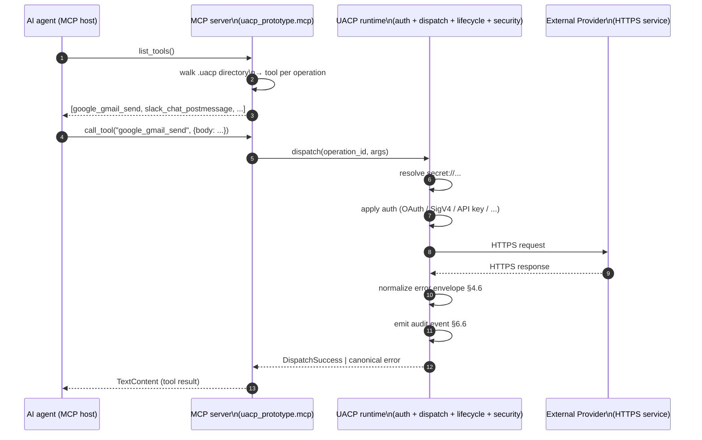

# UACP — MCP composition

UACP composes with the Model Context Protocol (MCP) rather than replacing it. An MCP-aware agent — Claude Code, Claude Desktop, Cursor, any MCP host — calls tools the same way it always does; the UACP layer sits behind the tool, doing the authentication and dispatch the agent doesn't need to know about. From the agent's perspective, a UACP-defined connection is just another MCP tool.

The reference implementation's `uacp_prototype.mcp` package is a thin server that walks a directory of `.uacp` files, derives one MCP tool per operation, and dispatches tool calls through the existing UACP runtime so authentication, retry, pagination, error normalization, and audit logging all apply transparently.

The composition is symmetric: anything reachable via UACP is automatically reachable from any MCP host, and the agent gains UACP's full security model (secret references, encryption-at-rest, scope enforcement, audit logging) without needing UACP-specific code.
