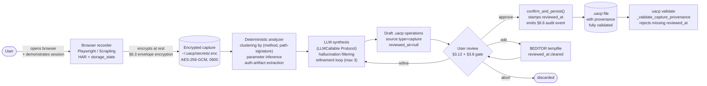

# UACP — Capture pipeline (§3.12)

§3.12 establishes a fourth schema source: a browser-demonstrated session that becomes a draft `.uacp` file. The pipeline is end-to-end demonstrable through the reference prototype: a user opens the target service in an instrumented browser, performs the actions they want their agent to learn, and the recorder captures every HTTP request as a HAR-1.2-format entry plus the post-login `storage_state` cookies. The deterministic analyzer clusters the captured requests into candidate operations; an LLM synthesizes those candidates into UACP operation drafts; the user reviews and approves each operation before it persists; the validator enforces the §3.12 + §3.8 mandatory-user-review rule below the CLI so the gate cannot be bypassed.

The pipeline preserves UACP's load-bearing properties throughout: captured artifacts are encrypted at rest with no plaintext fallback (§6.3); audit events scrub auth values (§6.6); the LLM never sees raw HAR — only the analyzer's structured summary; operations the LLM hallucinates beyond the candidate-cluster set are dropped mechanically rather than relying on prompt obedience; `source.type=capture` artifacts cannot be persisted without `reviewed_at`, enforced at the spec-loader level so the gate holds even if a future CLI bypasses the prompt.
